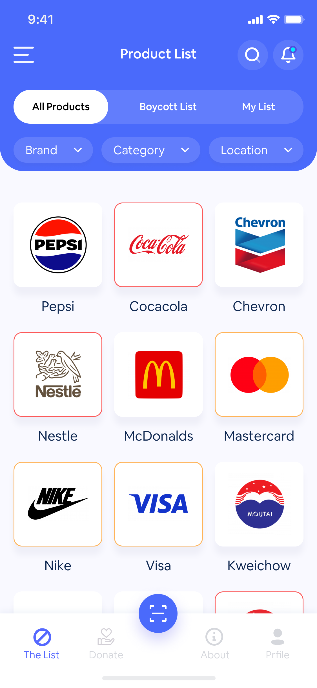
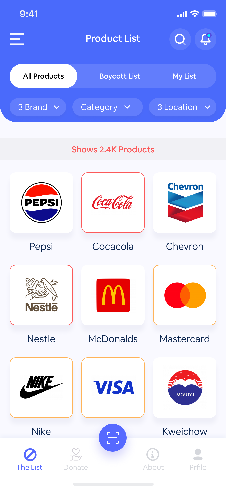
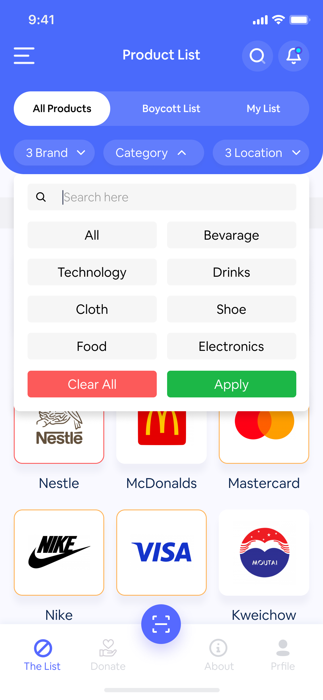
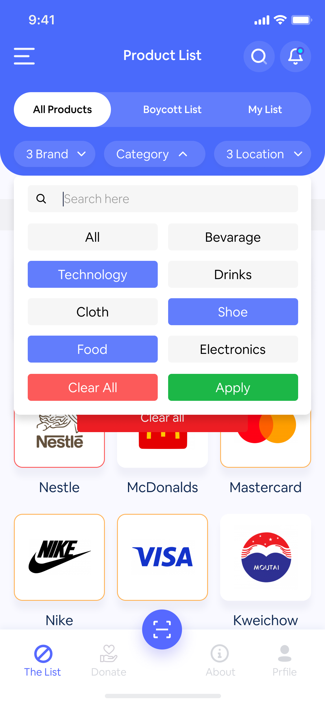
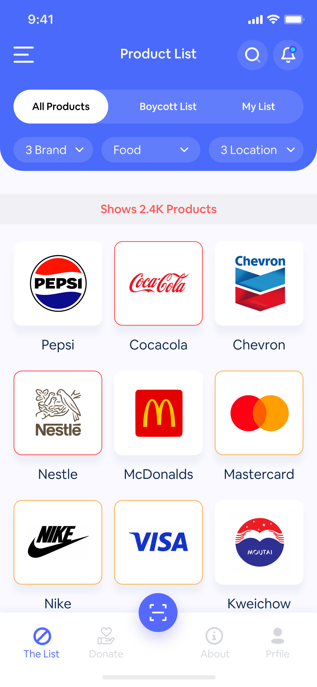

# Boycott - Android Java App

**Boycott** is an Android application designed to help users identify and avoid products from companies that they wish to boycott. The app includes a barcode scanner that allows users to quickly scan products and check whether they are on the boycott list.

---

## Features

- **Barcode Scanner**: Quickly scan the barcode of any product to check if it’s on the boycott list.
- **Product Database**: Easily browse through a list of products that need to be boycotted.
- **User-Friendly Interface**: A sleek and intuitive design that makes it simple for users to navigate.
- **Real-Time Updates**: Get the latest updates on products to boycott.

---

## Screenshots

Here are a few screenshots showcasing the app:







---

## Installation

1. Clone the repository:
   ```bash
   git clone https://github.com/your-username/boycott.git
